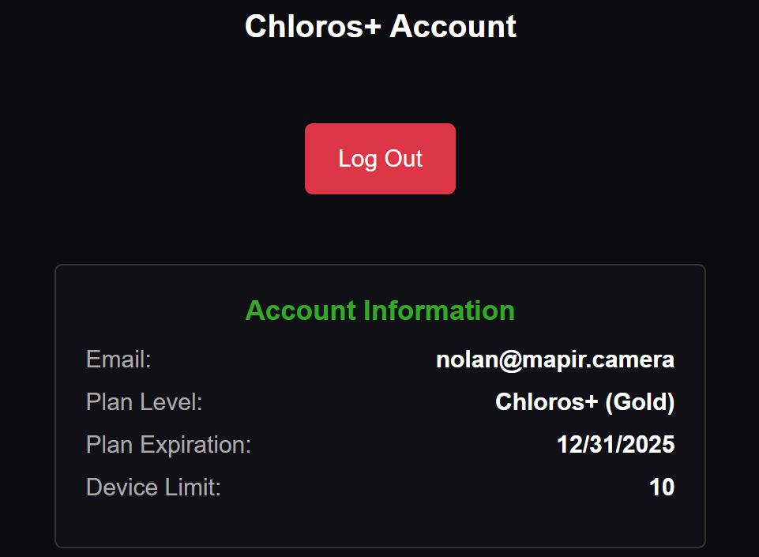

# Autentificare Chloros+

## Autentificare Chloros și Chloros (browser)

Meniul  din bara laterală vă permite să vă conectați la contul dvs. Chloros+ și să deblocați funcții suplimentare.

După conectare, vor fi afișate detaliile contului dvs.:

<figure><figcaption></figcaption></figure>## Autentificare CLI

Autentificați-vă cu datele de autentificare Chloros+ pentru a activa procesarea CLI. Pe Linux (fără GUI), aceasta este singura modalitate de a vă activa licența.

**Sintaxă:**

```bash
chloros-cli login <email> <password>
```


**Utilizatori SDK**: Python SDK oferă, de asemenea, o metodă programatică `logout()` pentru a șterge datele de autentificare stocate în cache. Consultați [documentația Python SDK](api-python-sdk.md#logout) pentru detalii.


**Exemplu:**

```powershell
chloros-cli login user@example.com 'MyP@ssw0rd123'
```


**Caractere speciale**: Utilizați ghilimele simple în jurul parolelor care conțin caractere precum `$`, `!` sau spații.


**Rezultat:**

<figure><figcaption></figcaption></figure>### Stocarea datelor de autentificare

Datele de autentificare stocate în cache sunt păstrate într-o locație specifică platformei:

| Platformă | Calea către cache-ul datelor de autentificare |
| --- | --- |
| **Windows** | `%APPDATA%\Chloros\cache\` |
| **Linux** | `~/.cache/chloros/` |

### Expirarea planului

Expirarea planului afișată în interfața grafică indică momentul în care licența dvs. va deveni invalidă. Pentru abonamentele lunare recurente, expirarea are loc la sfârșitul lunii. Pentru abonamentele anuale, expirarea are loc la un an de la începerea abonamentului. Verificarea licenței necesită o conexiune lunară la internet, cu o perioadă de grație de 30 de zile.

### Limita de dispozitive

Fiecare plan Chloros+ oferă un număr diferit de dispozitive înregistrate. Fiecare dispozitiv pe care vă conectați cu un cont Chloros+ va fi luat în calcul la numărul de dispozitive înregistrate. Puteți redenumi și elimina un dispozitiv de pe pagina contului dvs. MAPIR Cloud.

<table><thead><tr><th width="168.5999755859375" align="right">Planul Chloros+</th><th align="center">COPPER</th><th align="center">BRONZE</th><th align="center">SILVER</th><th align="center">AUR</th></tr></thead><tbody><tr><td align="right">Dispozitive acceptate</td><td align="center">2</td><td align="center">2</td><td align="center">5</td><td align="center">10</td></tr></tbody></table>
